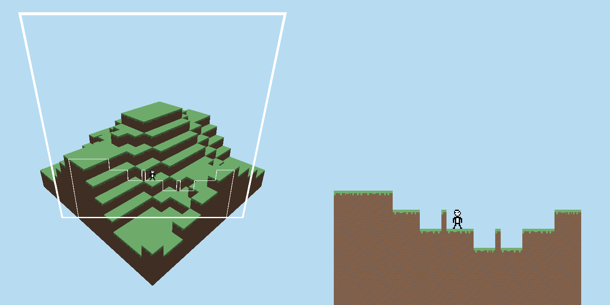
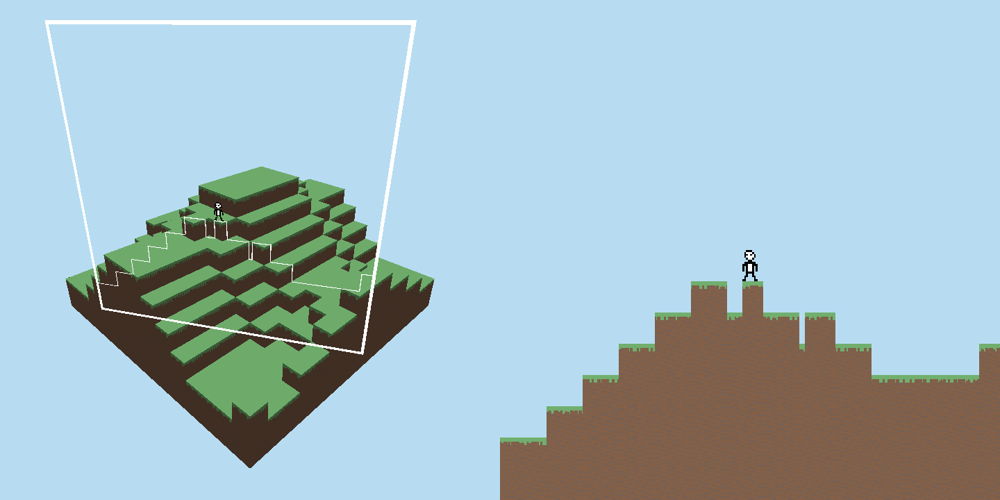
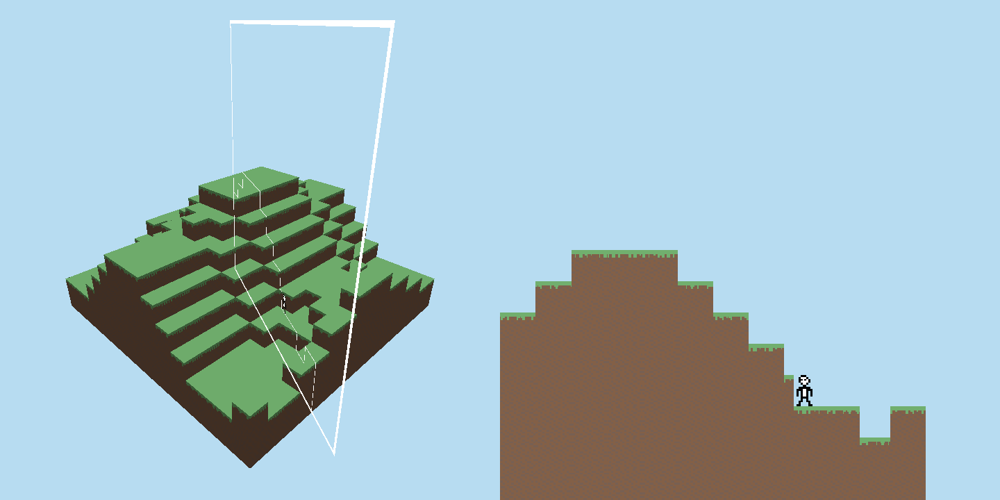

2D Cross Section of a 3D World
==================

## Description

Traversable 2D cross section of a 3D world using OpenGL, written in Rust.
This project is inspired by [4D Miner](https://4d-miner.fandom.com/wiki/4D_Miner).

Makes use of a geometry shader to calculate intersections of a plane with the 3D geometry, all intersections of the geometry with that plane are registered as a vertex on the 2D screen.

## Controls

TAB - Swap focus between player and plane

QE - Rotate plane clockwise/counter-clockwise around the Y-axis (up).

WASD - Move player or plane depending on focus

SPACE - Jump

## Screenshots

